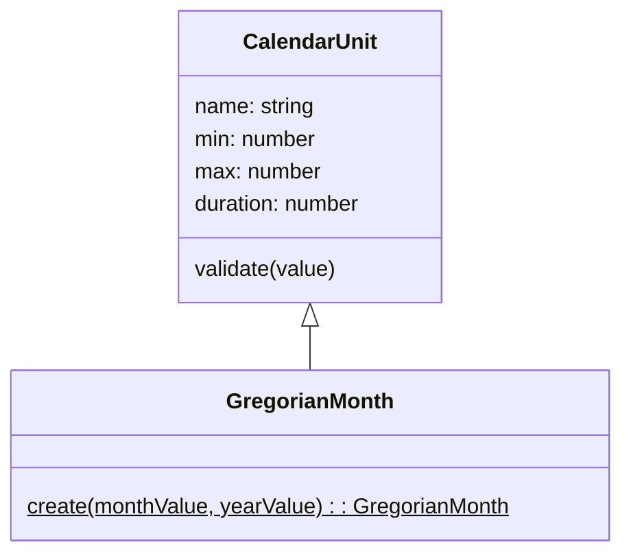

# Calendar units

Units are referenced by calendar values.

```mermaid
classDiagram
    class CalendarUnit {
        name: string
        min: number
        max: number
        duration: number
        validate(value)
    }
    class GregorianMonth {
        create(monthValue, yearValue): GregorianMonth$
    }
    CalendarUnit <|-- GregorianMonth
```
