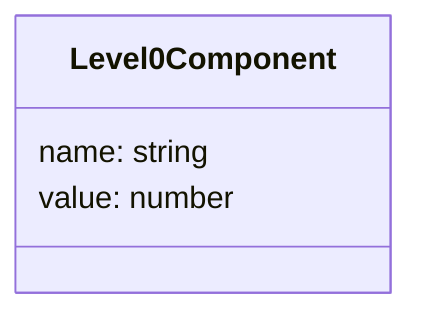
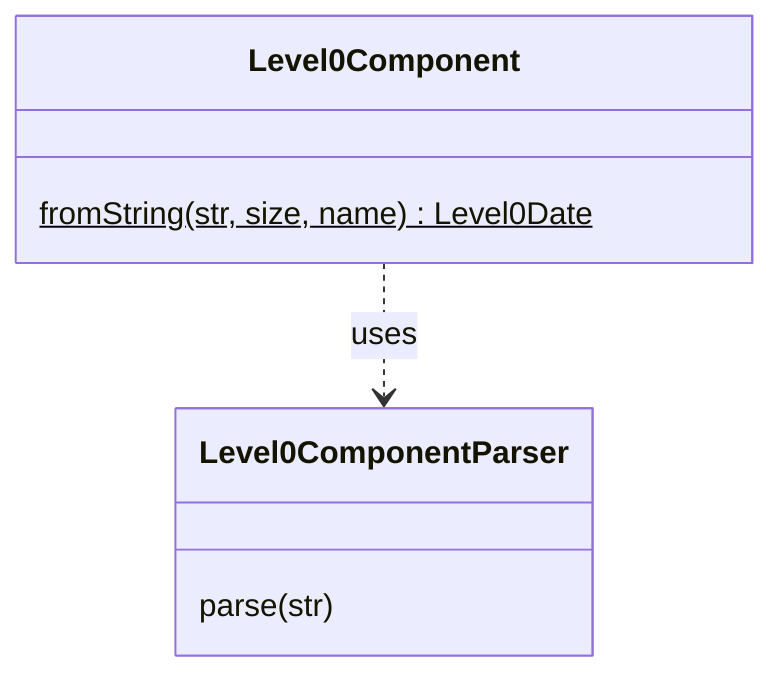

# EDTF level 0 date/time components

## Data type

Any level 0 date/time components (year, month, day, hour, minute, second) share the same properties:

```mermaid
classDiagram
    class Level0Component {
        name: string
        value: number
    }
```

## Parsing

```mermaid
classDiagram
    class Level0Component {
        fromString(str, size, name) Level0Date$
    }
    class Level0ComponentParser {
        parse(str)
    }
    Level0Component ..> Level0ComponentParser: uses
```
