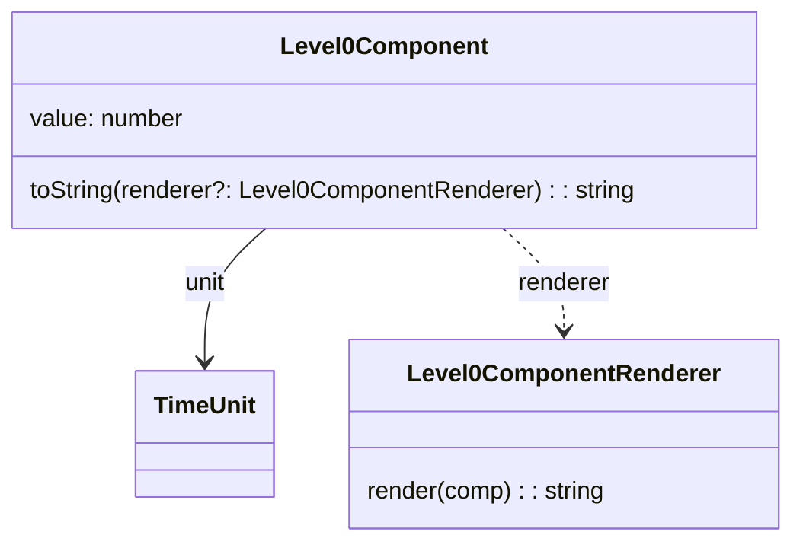
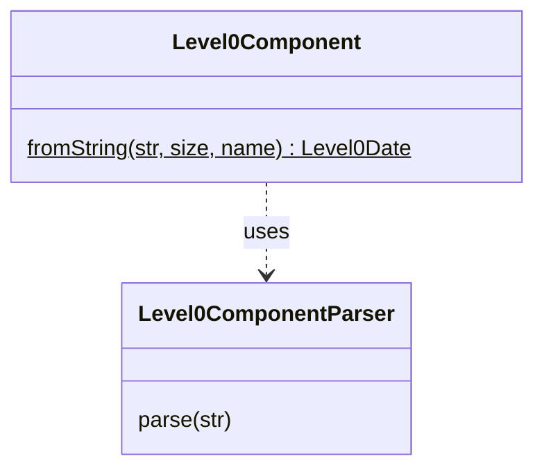

# EDTF level 0 date/time components

## Data type

Any level 0 date/time components (year, month, day, hour, minute, second) share the same properties:
- a **[unit](../../unit/README.md)**
- a **value** in this unit
- a **renderer** to format this value for display.

## Parsing

