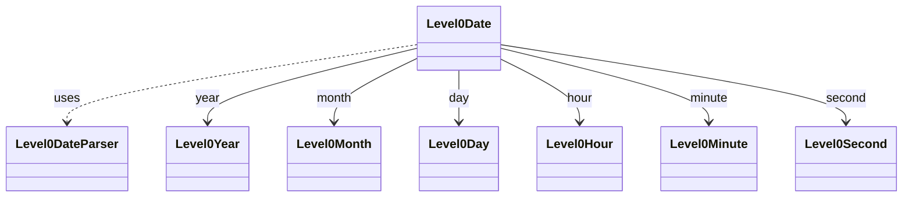
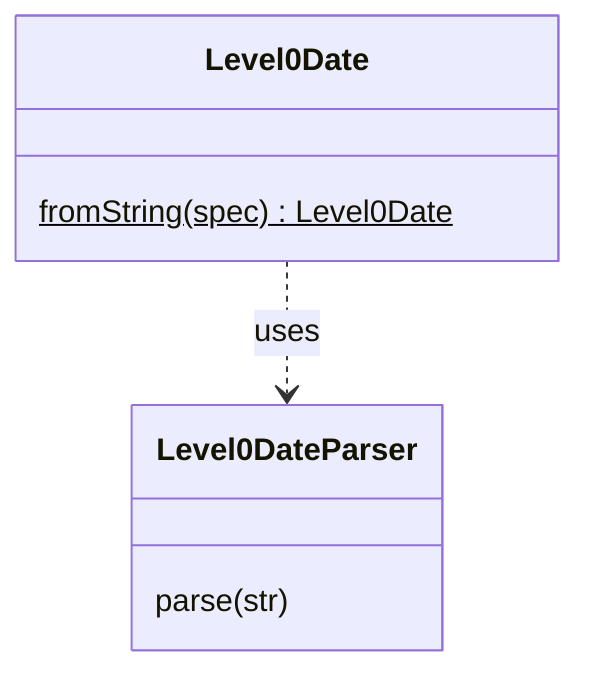

# EDTF level 0 Date

## Data type
A date is an aggregation of individual [Date level 0 components](../component/README.md):

```mermaid
classDiagram
    class Level0Date
    Level0Date ..> Level0DateParser: uses
    Level0Date --> Level0Year: year
    Level0Date --> Level0Month: month
    Level0Date --> Level0Day: day
    Level0Date --> Level0Hour: hour
    Level0Date --> Level0Minute: minute
    Level0Date --> Level0Second: second
```
## Parsing

```mermaid
classDiagram
    class Level0Date {
        fromString(spec) Level0Date$
    }
    class Level0DateParser {
        parse(str)
    }
    Level0Date ..> Level0DateParser: uses
```
