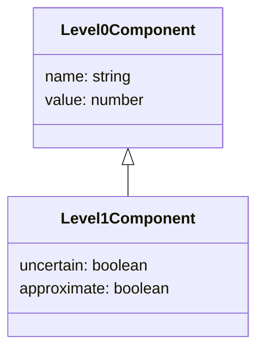
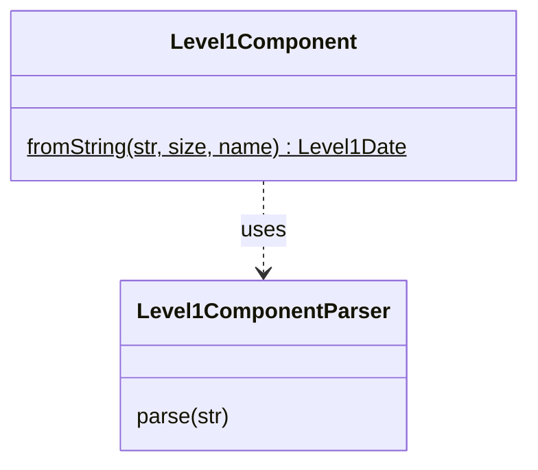

# EDTF level 1 datetime components

## Data type

Any level 1 date/time components (year, month, day, hour, minute, second) share the same properties, 
some of which being from its [level 0 date component](../../level0/component/README.md) part:

## Parsing

