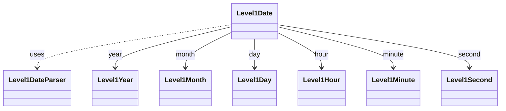
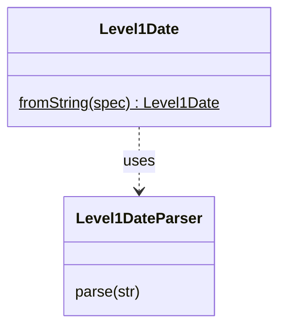

# EDTF level 1 Date

## Data type
A date is an aggregation of individual [date level 1 components](../component/README.md):

```mermaid
classDiagram
    class Level1Date
    Level1Date ..> Level1DateParser: uses
    Level1Date --> Level1Year: year
    Level1Date --> Level1Month: month
    Level1Date --> Level1Day: day
    Level1Date --> Level1Hour: hour
    Level1Date --> Level1Minute: minute
    Level1Date --> Level1Second: second
```
## Parsing

```mermaid
classDiagram
    class Level1Date {
        fromString(spec) Level1Date$
    }
    class Level1DateParser {
        parse(str)
    }
    Level1Date ..> Level1DateParser: uses
```
